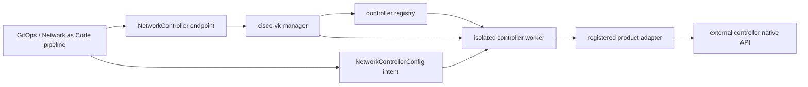

# Network Controller Extension Guide

This guide defines the contract for adding controller integrations to Cisco
Virtual Kubelet (CVK). The foundation is deliberately controller-neutral: a
controller type is not usable until a product adapter registers itself, and
the base scaffold contains no Catalyst Center, APIC, Meraki, or other
product-specific API behavior.

!!! note "Foundation status"
    `NetworkController` and `NetworkControllerConfig` provide the extension
    boundary. A registered adapter is still required before CVK creates a
    usable controller worker or sends requests to an external controller.

    On upgrade, apply both controller CRDs before rolling out the new manager.
    If either is missing, CVK preserves its existing device reconcilers but
    skips NetworkController registration for that manager process; apply the
    CRDs and restart the manager to enable the scaffold.

## Why Network as Code remains the public model

Cisco's [Network as Code data-model catalog](https://netascode.cisco.com/docs/data_models/)
distinguishes controller-centric, device-centric, and solution-centric models.
Controller integrations should consume the matching **controller-centric**
model rather than introduce another CVK-specific desired-state shape. For
example, the [Catalyst Center model](https://netascode.cisco.com/docs/data_models/catalyst_center/overview/)
is organized into `sites`, `network_settings`, `network_profiles`, `fabric`,
`templates`, `inventory`, `wireless`, `lan_automation`, and
`system_settings` sections.

CVK therefore treats Network as Code as the stable northbound contract and a
native adapter as the southbound execution boundary:

```text
Git / Network as Code toolchain
  -> resolved, versioned controller-centric document
  -> NetworkControllerConfig
  -> controller adapter plan / apply / observe
  -> the controller's native API and task model
```

CVK does not run Terraform or reimplement its inheritance and template
expansion. The source toolchain resolves those concerns first; CVK validates,
reconciles, observes drift, and reports status. This keeps existing Network as
Code repositories portable while allowing each adapter to handle native API
authentication, pagination, asynchronous tasks, and version quirks.

The following rules are invariants for every adapter:

- Network as Code field names and nesting remain authoritative at the API
  boundary. Product API objects do not leak into generic CRDs.
- The document must be resolved and carry an explicit model version before an
  adapter may contact the controller.
- Ownership is explicit per scope and managed section. An adapter must not
  mutate a section that the CR does not own.
- The non-mutating `report` mode is the default. `apply`, pruning, and remote
  deletion all require separate, explicit choices.
- Desired and observed values are not copied into status, events, or logs.
- Existing per-device transports and driver contracts remain unchanged. A
  controller adapter uses the controller's native API behind its boundary;
  shared transport code is appropriate only when its semantics are genuinely
  controller-neutral.

## Architecture and responsibility boundaries



| Component | Owns | Must not own |
|---|---|---|
| `NetworkController` | Endpoint URL, adapter type, credential reference, administrator-approved intent Secret aliases, TLS trust, neutral connection limits, pause state | Desired network configuration or product-specific API payloads |
| `NetworkControllerConfig` | Resolved Network as Code source, model provenance, section ownership, drift/apply/retention policy, and selection of approved Secret aliases | Endpoint credentials, arbitrary Secret names/keys, or raw observed controller responses |
| Manager reconciler | Registry lookup and the worker's Kubernetes Deployment, ConfigMap, Secret projections, ServiceAccount, and RoleBinding | Secret values, authentication, product API calls, planning, or remote cleanup |
| Controller registry | Immutable adapter descriptors, factories, capabilities, supported model contract, worker RBAC profile | Network clients, background goroutines, or imports of concrete adapters |
| Isolated worker | Per-endpoint process, credentials, lifecycle, probes, and adapter setup within a namespace-scoped Kubernetes cache/RBAC boundary | Other namespaces or virtual-node/device-driver behavior |
| Product adapter | Model validation, native client, observe/plan/apply/verify, task recovery, and sanitized status | Generic deployment orchestration or unbounded RBAC |

The registry is a dependency-inversion boundary. Generic manager and registry
packages must never import a concrete product adapter. The binary composition
root imports enabled adapters, making their descriptors visible to the
manager; only the `controller-worker` path may invoke a registered factory or
set up product reconcilers. An unknown `spec.type` fails closed: no untrusted
fallback client is created and no external request is attempted.

One worker Deployment is created per `NetworkController`. This preserves the
existing CVK pattern of isolating each endpoint's process, credential and trust
mounts, native client sessions, failure domain, and rate limits. It does not
isolate Kubernetes API permissions or all informer data by endpoint: the
RoleBinding and configuration/source caches are namespace-scoped.
Workers use a `Recreate` rollout strategy so two writers cannot overlap during
an update. Remote reachability belongs in `NetworkController.status`; it must
not be a liveness check that causes a restart loop during a controller outage.

Use one `NetworkController` per dedicated namespace when endpoints or their
configuration authors are not mutually trusted. Multiple endpoints in one
namespace intentionally share the Kubernetes API trust, RBAC, and cache
boundary even though their processes and credential mounts remain separate.

The registry descriptor advertises candidate capabilities and model coverage;
it is not proof that a particular endpoint exposes them. Endpoint-discovered
support in `status.capabilities`, authentication state, product/API versions,
and compatibility conditions are adapter-owned observations. The manager must
not infer those values from descriptor metadata.

### Bootstrap and descriptor binding

The manager-to-worker bootstrap is an immutable, non-sensitive ConfigMap. Its
identity data is limited to the `NetworkController` namespace, name,
Kubernetes UID, and registered type (plus the private document's version and
kind). It contains no endpoint settings, Secret or ConfigMap references,
credential data, intent, or runtime mount paths. The worker fetches the live
`NetworkController` only after validating this bootstrap.

The Pod arguments independently bind the namespace, name, UID, registered
type, and expected `NetworkController` generation. They also carry a digest of
the manager's registered adapter descriptor. At startup the worker requires
all three views to agree: Pod identity, immutable bootstrap, and the current
API object. It also requires the adapter to be registered in the worker image
with exactly the same descriptor digest. An invalid bootstrap, unknown type,
or descriptor mismatch fails before product scheme installation. The worker
then fetches the live `NetworkController` directly and rejects a UID, type, or
generation mismatch before adapter factory construction or setup and before
any external controller request.

The generation binding couples the live spec to the projected volumes used to
build that Pod. If credential or CA references change while an older Pod is
starting, that Pod exits instead of pairing old credential/CA mounts with the
new spec; the manager-created Pod for the new generation performs setup.

Runtime mount locations are code-owned constants, not mutable bootstrap input:

| Material | Fixed worker path |
|---|---|
| Endpoint credentials | `/var/run/secrets/cisco-vk/controller/credentials` |
| Optional CA directory | `/var/run/secrets/cisco-vk/controller-ca` |
| Optional CA bundle | `/var/run/secrets/cisco-vk/controller-ca/ca.crt` |
| Intent Secret projections | `/var/run/secrets/cisco-vk/controller-intent` |

The manager creates the bootstrap ConfigMap with `immutable: true`, and
Kubernetes makes a RoleBinding's `roleRef` immutable. Worker resources carry
the explicit annotations `cisco.vk/network-controller-name` and
`cisco.vk/network-controller-uid`; they are not Kubernetes owner-reference
children of the endpoint. If an annotated bootstrap ConfigMap or RoleBinding
drifts from the registered contract, the manager deletes that narrow object
and recreates it on the next reconcile. It never adopts or replaces a
conflicting object whose name/UID annotations do not match.

An object with the expected generated name but different or missing controller
identity annotations is treated as a foreign-object collision. The manager
leaves it untouched, refuses to continue that worker reconciliation, and emits
a sanitized Warning Event with reason `WorkerObjectCollision`. Inspect these
without exposing object contents with:

```bash
kubectl events -n <namespace> \
  --for networkcontroller/<name> \
  --types=Warning
```

## API contract

`NetworkController` is namespaced and uses `cisco.vk/v1alpha1`. Its immutable
`spec.type` and immutable HTTPS `spec.endpoint` jointly define the stable
controller identity. `credentialSecretRef` and an optional
`tls.caConfigMapRef` resolve only within the same namespace and may rotate
without changing that identity. `preferredAPIVersion` is a hint or pin; the
adapter remains responsible for discovery and compatibility checks.
Connection timeout, health-check interval, concurrency, and rate limits are
neutral guardrails, not a substitute for adapter-specific retry semantics.

`spec.intentSecretSources` is an administrator-owned allow-list for sensitive
values that resolved Network as Code intent may consume. Each stable alias maps
to exactly one name/key in a same-namespace Secret. A tenant configuration does
not supply that name or key directly.

The manager also fences duplicate endpoint declarations within a namespace.
Endpoint identity for this first guard is the **exact stored
`spec.endpoint` string**; it does not normalize URLs and it does not compare
objects across namespaces or clusters. The deterministic owner is the object
with the earliest creation timestamp, then the lexicographically smallest
name, then UID. Any non-owner stays quiesced and is periodically requeued so it
can become active after the owner is deleted. Before the elected owner may
start, it also removes every managed loser worker in staged Pod-first order;
peer event fan-out is therefore an acceleration rather than the safety
boundary. This prevents two local workers from targeting one exactly declared
endpoint, including timestamp ties, while leaving normalized and cross-boundary
endpoint identity as a future production decision.

`NetworkControllerConfig` is namespaced and uses
`config.cisco.vk/v1alpha1`. It references a controller in the same namespace
and declares:

- an immutable `scope` (default `global`) and a closed `managedSections` set;
- exactly one `source.inline` or `source.configMapRef`;
- required `modelSource.format`, `modelSource.modelVersion`, and
  `modelSource.resolved: true`, with optional schema and source provenance;
- `mode: report|apply`, defaulting to `report`;
- independently safe `prunePolicy` and `deletionPolicy`, both defaulting to
  `Retain`;
- optional `secretRefs` whose `source` selects an administrator-approved alias
  and places its value at a declared section/path;
- bounded drift and asynchronous-task timing.

The two resources are separate intentionally. Rotating credentials or TLS
trust must not rewrite desired network intent, and changing intent must not
recreate the endpoint identity. Replacing the endpoint URL requires a new
`NetworkController` and an explicit retargeting of intent. This prevents
persisted asynchronous task IDs and section-ownership state from being
replayed against a different external controller.

The immutability rules use CRD CEL transition validation (`oldSelf`). A
supported Kubernetes 1.28 API server must have the
`CustomResourceValidationExpressions` feature gate enabled; it is beta and
enabled by default in that release. The feature is GA in Kubernetes 1.29 and
later. CVK's runtime validators check the current object shape, but cannot
reconstruct the previous object and therefore do not replace these transition
rules. Do not deploy the controller scaffold on an API server where CEL
transition validation is disabled.

### Model compatibility and upgrades

Every adapter must make the shared fail-closed contract gate its first
per-config reconcile operation, retaining `opts.IntentSecretPath` from the
factory options and calling it exactly as follows:

```go
if err := controlleradapter.ValidateConfigContract(controller, config, opts.IntentSecretPath); err != nil {
	// Publish a sanitized failure condition and stop reconciling this config.
}
```

This call must complete before the adapter loads or parses the source, builds
a plan, or makes any external request. A missing or non-regular intent Secret
projection must be mapped to `IntentSecretsReady=False`; the affected config
is skipped until the projection is ready. `IntentSecretRelativePath` and the
fixed projection root are orchestration-owned contracts. Adapters must not
reimplement the path algorithm, accept an adapter-configurable replacement,
or bypass the common gate.

Before making an external request, an adapter must validate all of the
following:

1. `modelSource.format` exactly matches the format in its registered
   descriptor, such as `netascode-catalyst-center`.
2. `modelSource.resolved` is true and `modelSource.modelVersion` is in the
   adapter's qualified version set.
3. Every `managedSections` entry is advertised by the descriptor and exists in
   the expected controller-centric model stripe.
4. The schemaless source passes the adapter's model-level and semantic
   validation for the target controller/API version.

Adapters must not silently reinterpret an unknown version or upgrade a payload
in memory. Qualifying a new upstream model version requires fixture-based
tests, adding it to the descriptor, and deploying a compatible adapter build.
The GitOps change should then update the resolved source and
`modelSource.modelVersion` together. `schemaDigest`, `exporter`, and
`sourceRevision` should be populated when the source pipeline can provide them
so an applied result is traceable to an immutable schema and Git revision.

## Reconciliation and ownership

Controller reconciliation follows an observe-plan-act-verify loop:

1. Run `controlleradapter.ValidateConfigContract` and stop this config reconcile on
   failure.
2. Load and parse the already-resolved inline or ConfigMap-backed source, then
   run product-specific model and semantic validation.
3. Acquire ownership for each
   `(controller, scope, section)` tuple.
4. Read authoritative state from the controller and build a redacted plan.
5. In `report` mode, publish drift without mutation. In `apply` mode, execute
   only the managed sections and persist enough sanitized task identity to
   resume asynchronous polling after a restart.
6. Re-read the controller, verify convergence, and update bounded conditions,
   section states, hashes, and drift metadata.

!!! warning "Hard release gate for remote mutation"
    The current zero-adapter scaffold exposes section-ownership vocabulary but
    deliberately grants no Lease permission to the base worker role and does
    not yet provide a generic `SectionLeaser`. A shared, controller-neutral
    `SectionLeaser`, its conformance suite, and a separate statically reviewed
    mutation RBAC profile are hard release gates before the first adapter may
    support `mode: apply`, `prunePolicy: Delete`, or any remote-deletion path,
    including `deletionPolicy: Delete`. Tests must prove exclusive acquisition
    for each `(controller, scope, section)` tuple, renewal, conflict handling,
    expiry and takeover, cancellation/restart behavior, and that no mutation
    occurs without a currently held lease. The manager must bind that future
    role only through an explicit audited allow-list. Registry validation
    currently accepts only the base report-worker role; a new role, its chart
    policy, and the manager's `bind` marker must land in one reviewed change.
    Until all gates land, adapters must remain report-only regardless of the
    vocabulary exposed by the API.

Adapters must make retries idempotent. An ambiguous timeout is not proof of
failure: recover by task ID or by observing state before submitting a second
mutation. Controller request rate limits, backoff, and `taskTimeout` must be
honored across reconciles.

The manager owns the `cisco.vk/network-controller-protection` finalizer on each
`NetworkController`. When endpoint deletion is requested, that finalizer keeps
the endpoint worker available while any same-namespace
`NetworkControllerConfig` still references it. After the dependent configs are
gone, the manager quiesces the annotated Deployment, RoleBinding,
ServiceAccount, and bootstrap ConfigMap, then removes the protection finalizer.
Deleting the endpoint therefore does **not** implicitly delete
controller-managed network objects.

Worker resources deliberately have no Kubernetes owner reference to the
`NetworkController`. The manager identifies its children by stable name plus
the controller name/UID annotations and deletes them explicitly only after the
dependency check passes. Consequently, foreground deletion cannot let garbage
collection remove the worker early and bypass the default `Retain` lifecycle.

!!! danger "Do not remove the protection finalizer"
    Normal deletion must leave `cisco.vk/network-controller-protection`
    intact. If an administrator forcibly removes it from a live endpoint and
    deletion completes before reconciliation can restore it, the credentialed
    worker Deployment and its annotation-associated ServiceAccount,
    RoleBinding, and bootstrap ConfigMap can be orphaned. Delete dependent
    `NetworkControllerConfig` resources first, then delete the
    `NetworkController` normally and let the manager quiesce the worker and
    remove the finalizer.

Remote lifecycle intent belongs to `NetworkControllerConfig`, and `Retain` is
the safe default. Workers cannot add, update, or remove finalizers. If a future
adapter supports `deletionPolicy: Delete`, a separate control-plane finalizer
must retain the config object while the adapter reports cleanup progress
through status; only the control-plane reconciler completes that handshake and
removes the finalizer. Product code must not broaden the worker role to take
control of Kubernetes object lifecycle.

Pausing a `NetworkController` stops its worker without discarding status or
intent. A paused or unavailable endpoint never transfers section ownership to
another CR implicitly.

## Security boundary

The manager creates a unique ServiceAccount and namespaced RoleBinding for each
worker. The reusable `cisco-virtual-kubelet-controller-worker` ClusterRole is
therefore constrained to the worker's namespace and grants only:

- read access to `NetworkController` and write access to its status;
- read access to `NetworkControllerConfig` and write access to its status;
- read-only source ConfigMaps;
- Events for bounded, sanitized operational feedback.

The unique ServiceAccount isolates identity and auditing, but its RoleBinding
does not create an endpoint-level Kubernetes authorization boundary. In
particular, Kubernetes authorizes that worker to update or patch the
`/status` subresource of **every** `NetworkController` and
`NetworkControllerConfig` in its namespace, not only the endpoint that caused
its Deployment. The name-filtered endpoint cache and common contract gate
constrain a conforming adapter's behavior; they do not narrow RBAC. Controller
configs and source data also remain namespace-scoped. Treat the namespace as
the API trust, RBAC, status-write, and cache boundary. Use a dedicated
namespace per controller whenever endpoints, adapter code, or config authors
are not mutually trusted.

A future scale optimization may use a manager-owned key-existence label such
as `nc.cisco.vk/<uid-hash>: "true"` on each controller's configs and source
objects. A shared ConfigMap may carry several controller keys. Manager-owned
stamping and cleanup plus a bounded, collision-tested UID hash are prerequisites
before a worker selects on that key. This is a performance and memory
optimization only: labels and cache selectors are not authorization controls
and must never replace the dedicated-namespace trust boundary.

Updates and patches apply only to the `/status` subresources. A worker cannot
mutate either resource's spec, metadata, or finalizers. The role also has no
Secret, Node, Pod, workload, or wildcard access. Endpoint
credentials are mounted read-only from the referenced same-namespace Secret by
the kubelet. The manager writes only the controller namespace, name, UID, and
adapter type to the worker bootstrap and binds the expected generation through
Pod arguments; mount paths come from fixed runtime constants. The worker
fetches current endpoint metadata through the API and consumes credential files
through those fixed paths. It must never fetch Secrets through a Kubernetes
client or place tokens in environment variables, arguments, status, events,
or logs.

Projected credential, CA, and intent-Secret volumes update in place. The
optional CA is mounted as the live directory
`/var/run/secrets/cisco-vk/controller-ca`, not as a `subPath` file, so kubelet
can publish a ConfigMap rotation without restarting the worker. The worker's
generic projected-material watcher polls Kubernetes AtomicWriter `..data`
symlinks every five seconds without reading or hashing values. It passes
adapters a coalescing
`Options.MaterialRotation.Changes` channel and a fifteen-minute
`MaxSessionLifetime`.

An adapter must consume that single channel once and fan it out internally if
it has multiple reconcilers. On notification it must discard cached
authentication, TLS, and resolved-intent state, re-read the mounted files, and
requeue affected work before its next external request. Independently, it must
rebuild clients and sessions by the maximum lifetime even if no event arrives.
Caching credential or CA bytes only at process start is non-conforming.

### Intent Secret authorization

Secret selection is deliberately split across two authorization domains:

1. An administrator who can modify `NetworkController` defines
   `spec.intentSecretSources`, mapping an alias to one same-namespace Secret
   name/key.
2. A configuration author uses
   `NetworkControllerConfig.spec.secretRefs[].source` to select only that alias
   and its destination section/path. The config object cannot name a Secret or
   key.
3. The manager translates only approved aliases into read-only projected
   files. It writes references into the Pod specification; it never reads
   Secret values. The kubelet resolves the projection.

This prevents a configuration reconciler from turning the manager into a
Secret-read deputy. The boundary is effective only when Kubernetes RBAC
reserves `NetworkController` creation and updates for administrators while
delegating `NetworkControllerConfig` separately to configuration authors.

An unknown alias, invalid section/path, or excess projection invalidates only
that projection. The manager skips it and emits a sanitized
`IntentSecretProjectionSkipped` warning/event; it does not write
`NetworkControllerConfig` status. A missing or otherwise unresolved projected
file is optional at Pod-mount time, so the adapter skips the affected config
and reports `IntentSecretsReady=False` through that config's status. Neither
case quiesces the endpoint worker or blocks other valid configs. Status and
drift reports identify aliases, redacted paths, and change types only—never
Secret names, keys, or values.

Server certificate verification is enabled by default. A custom CA is supplied
through `tls.caConfigMapRef`; `insecureSkipVerify` is a lab/migration escape
hatch and must not be the production default. Future adapter-specific RBAC
must be a separately reviewed static ClusterRole selected by its descriptor,
accepted by the registry's closed role allow-list, and added to the manager's
matching `bind` policy—not dynamically generated rules or a broadening of the
base role. Additional
roles must not grant workers update/patch on the main `NetworkController` or
`NetworkControllerConfig` resources or access to their finalizers.

## Adding a controller adapter

Adding a product integration should normally require no generic CRD change:

1. Choose the upstream controller-centric Network as Code stripe. Record the
   exact format, qualified model versions, supported top-level sections, and
   source fixtures.
2. Implement a package below the controller adapter tree. Keep its native API
   types and client private to that package.
3. Implement the generic adapter lifecycle. Construction validates local
   options only; it must not dial the endpoint or start goroutines. Register
   reconcilers and manager-owned runnables during adapter setup so cancellation
   and shutdown follow the worker context.
4. Register one immutable descriptor and factory. Descriptors use a stable,
   DNS-label controller type, a `netascode-*` model format, bounded unique
   capabilities/sections, and an audited worker ClusterRole name.
5. Import the adapter only from
   `cmd/cisco-vk/controller_adapters_register.go`. The manager may read the
   registered descriptor, but it must never invoke the factory. Do not add
   product branches to the neutral registry, manager reconciler, per-device
   driver factory, or existing transport packages.
6. Add conformance tests for common contract-gate ordering,
   `IntentSecretsReady` failure handling, descriptor validation,
   model/version rejection, report-before-apply behavior, section ownership,
   idempotency, async task recovery, redaction, credential rotation, TLS
   verification, rate limiting, and cancellation.
7. If the adapter needs Kubernetes permissions beyond the base worker role,
   add a static least-privilege ClusterRole and an explicit manager-side
   allowlist entry. Explain and test every extra resource and verb. Never add
   Secret reads or mutation of controller/config specs, metadata, or
   finalizers.

Registration is a build-time contract, not runtime configuration. Invalid or
duplicate descriptors stop process initialization; an unregistered
`NetworkController.spec.type` produces no worker. The manager passes the
selected descriptor digest into the Pod, and the worker refuses to start if
its compiled registration differs. This makes accidentally mixing manager and
adapter images fail closed instead of silently changing model, capability, or
RBAC behavior.

The acceptance bar is that removing the adapter package and its composition-
root import leaves the generic APIs, registry, manager, worker, existing device
drivers, and transports building and behaving identically.
