# Cisco Virtual Kubelet — Production Deployment Guide

This guide covers everything an operator needs to deploy `cisco-virtual-kubelet` against a fleet of Cisco IOS-XE devices in production. It assumes familiarity with Kubernetes (Helm, kubectl, CRDs, RBAC) but no prior knowledge of cisco-vk internals.

**Audience**: platform engineers, network operators, SREs running cisco-vk against IOS-XE devices in a regulated production environment.
**Status**: branch `pr/johalley/ciscoconfig_xe`, 2026-04-28. See [`release-readiness-evaluation.md`](./release-readiness-evaluation.md) for known gaps and the pre-tag punch-list.

---

## 1. What cisco-vk does

cisco-vk presents an IOS-XE device as a Kubernetes virtual node. Two independent subsystems run inside the cisco-vk pod:

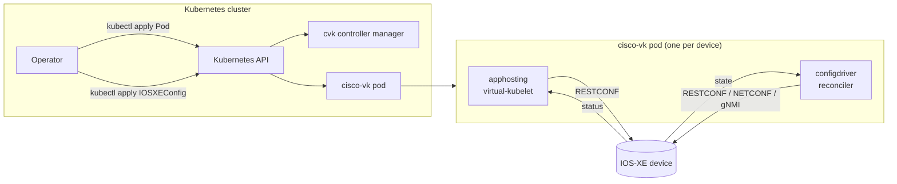

- **apphosting** — the original cisco-vk subsystem. Schedules Kubernetes Pods onto the device's IOx app-hosting framework. Uses RESTCONF on port 443.
- **configdriver** (this branch's contribution) — declarative IOS-XE configuration via `IOSXEConfig` CRs. Three transports configurable per-CR: RESTCONF, NETCONF, gNMI.

The two share a `CiscoDevice` CR for connection details + credentials, then run independently. Failures in one don't fail the other (apphosting probe failure logs a hint and is fail-fast; configdriver has its own per-tick reconcile).

---

## 2. Architectural shape

### 2.1 Topology choices

cisco-vk supports two topologies. Choose at install time via `--set aggregator.enabled=true|false`.

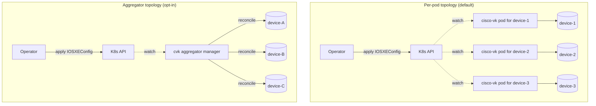

| Choice | When to use | Failure isolation | Cost |
|---|---|---|---|
| **Per-pod** | Production fleets, regulated environments, mixed-vendor where blast radius matters | Per-device pod; one device's reconcile failure is isolated | One pod per device |
| **Aggregator** | Lab / small fleets / development | Single manager; pod failure pauses the whole fleet until restart | One pod per cluster |

**Default in this guide**: per-pod. Switch to aggregator only after explicit operator review.

### 2.2 CRD set

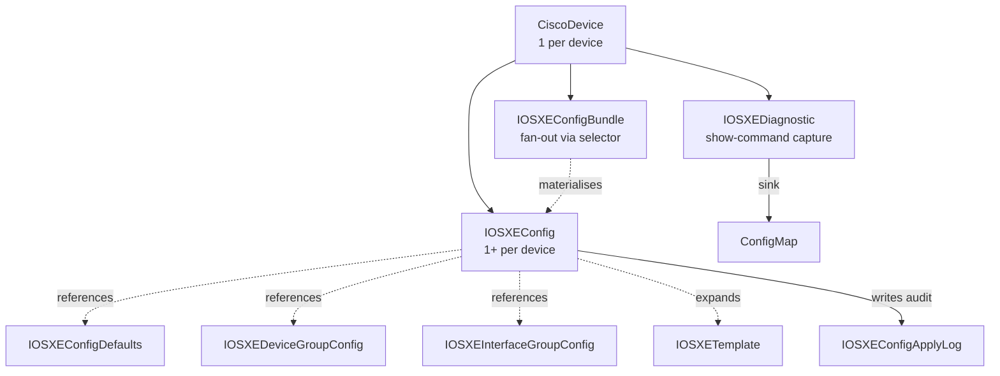

Per-CR purpose:

| CR | Scope | What it holds |
|---|---|---|
| `CiscoDevice` | per device | address, port, username, credentialSecretRef, tls, transport, driver=XE |
| `IOSXEConfig` | per device | deviceRef, managedFamilies, source (inline / ConfigMapRef), driftPolicy, transactional, writeStartup, pruneOnRelinquish, confirmTimeoutSeconds, atomicReplace |
| `IOSXEConfigBundle` | cluster | template + selector; controller fans out to per-device IOSXEConfig CRs |
| `IOSXEConfigDefaults` | cluster | global merge layer (lowest precedence) |
| `IOSXEDeviceGroupConfig` | per device-group | group merge layer |
| `IOSXEInterfaceGroupConfig` | per interface-group | per-interface merge layer |
| `IOSXETemplate` | cluster | parameterised reusable config fragment |
| `IOSXEConfigApplyLog` | per device | per-tick audit record (circular buffer; replay-capable) |
| `IOSXEDiagnostic` | per device | show-command capture, redact-by-default |

### 2.3 Reconcile flow

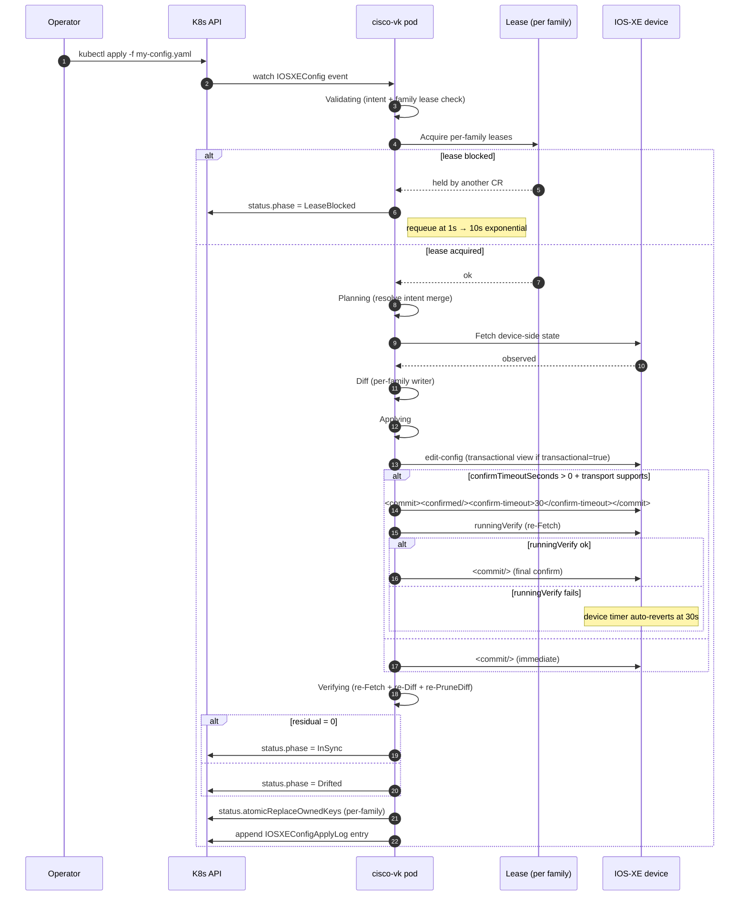

**Key states** in `IOSXEConfig.status.phase`:

- `Pending` — initial.
- `Validating` — checking intent + leases.
- `Planning` — Fetch + Diff in progress.
- `Applying` — Mutate in progress.
- `Verifying` — re-Fetch + re-Diff to confirm.
- `InSync` — terminal: device matches intent.
- `Drifted` — terminal: residual ops detected post-apply (device rejected something silently).
- `Failed` — terminal: ApplyError, transport error, or Wave 10 auto-revert fired.
- `LeaseBlocked` — transient: another CR holds a managed-family lease.
- `Paused` — operator-set.

---

## 3. Wave 10 safety nets

The recommended-default for any CR that manages risk-sensitive families (BGP, ACL, management-plane, VRF):

```yaml
spec:
  transactional: true              # NETCONF candidate datastore
  confirmTimeoutSeconds: 30        # device auto-reverts after 30s if no confirm
  atomicReplace: true              # intent is authoritative for managed families
```

### 3.1 Confirmed-commit auto-revert (RFC 6241 §8.4)

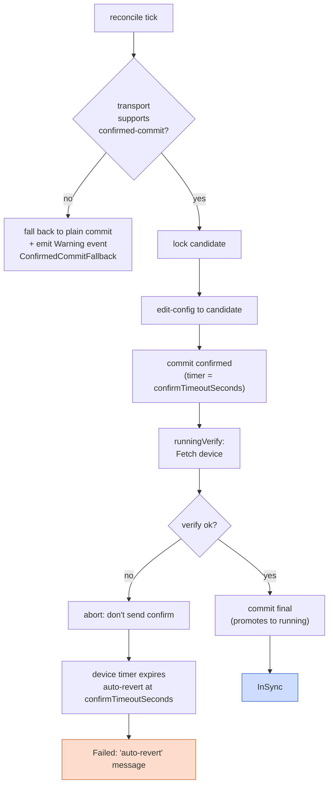

**Why it matters**: a config push that breaks the controller's session (e.g. an ACL that filters the controller's source IP) auto-reverts at the device side. The pod can't `confirm` because its session is dead; the device's own timer fires at `confirmTimeoutSeconds` and rolls back the change. No human intervention required, no out-of-band recovery, no permanently-locked-out device.

### 3.2 Atomic-replace cross-family

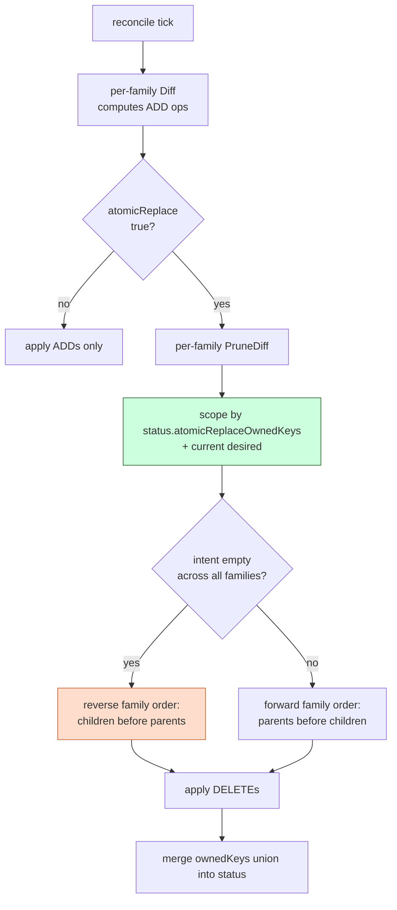

**Why scoped (not global)**: an atomic-replace CR with `managedFamilies: [vlan, vrf, interface_loopback]` and an empty intent would otherwise try to delete every device-side VLAN, every VRF (including Mgmt-vrf), every loopback (including Loopback 0 used by OSPF). The device's must-violation defense correctly refuses the bound-entry deletes and the CR ends in `Failed` permanently.

The Wave 10.3 scope refinement tracks per-CR `status.atomicReplaceOwnedKeys` so atomic-replace only deletes entries the CR has previously applied. Baseline state stays untouched.

### 3.3 Both safety nets composed

The recommended default. Every CR that manages risk-sensitive families should set both:

```yaml
spec:
  transactional: true
  confirmTimeoutSeconds: 30
  atomicReplace: true
```

This is the configuration test 13 validates end-to-end — apply lands tentatively, confirmed-commit fires, intent is authoritative, scoped prune deletes only owned entries, both safety nets compose correctly.

---

## 4. Transport selection

`spec.transport` on the `CiscoDevice` CR governs the configdriver's read/write path (apphosting always uses RESTCONF):

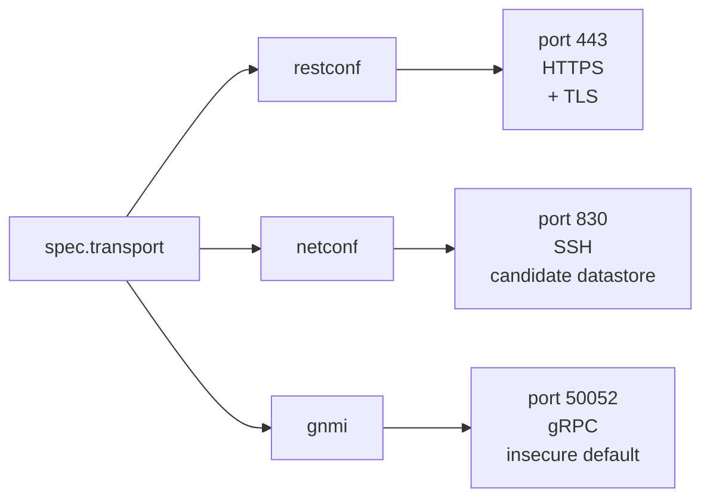

| Transport | Strengths | Weaknesses | When to pick |
|---|---|---|---|
| **RESTCONF** | Universal IOS-XE 16.x+; HTTPS; simple HTTP debugging | No transactions; no confirmed-commit; no candidate datastore | Lab; small fleets; baseline reads |
| **NETCONF** | RFC 6241 transactions; confirmed-commit; candidate datastore; rollback-on-error | Requires `netconf-yang` enabled on device; SSH host-key pinning | Production; risk-sensitive families |
| **gNMI** | OpenConfig support; on-change Subscribe; gRPC efficiency | Requires `gnxi server` (or secure server); device YANG-model coverage varies | Multi-vendor fleets; observability-heavy |

### 4.1 Transport-flip pattern

When changing `spec.transport`, **leave `spec.port: 443` and `spec.tls.enabled: true` at the apphosting defaults**. The configdriver factory recognises the apphosting-shaped values and falls through to the per-protocol default (830 for NETCONF, 50052 for gNMI insecure).

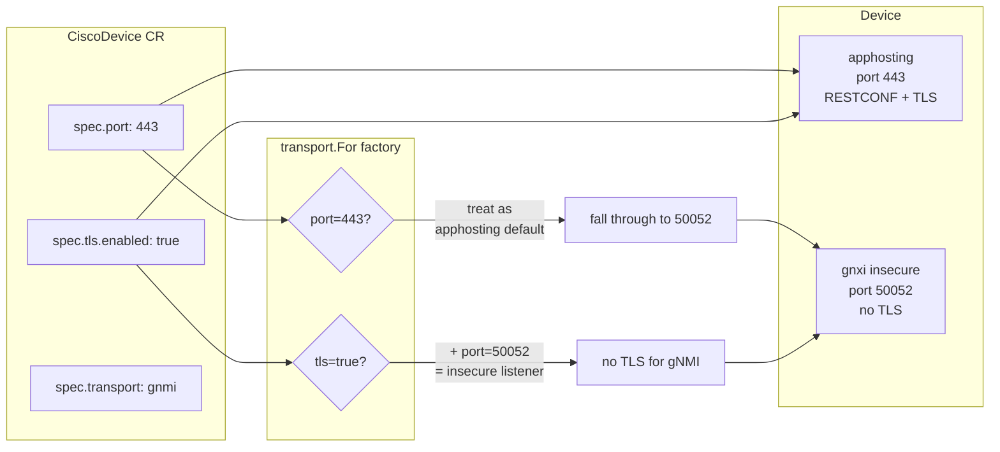

**Don't change `spec.port` away from 443** — apphosting needs it for its `/.well-known/host-meta` connectivity probe. The transport-flip is for the configdriver's read/write path only.

### 4.2 Transport-aware capabilities


When a CR requests a capability the active transport doesn't have, the engine emits a `Warning` event and falls back. Examples:

- `confirmTimeoutSeconds: 30` on a RESTCONF-only device → `ConfirmedCommitFallback` event with reason `transport does not implement ConfirmedCommitter`.
- `transactional: true` on a non-transactional transport → `Warning` event + fall back to immediate commit.

---

## 5. Diagnostics

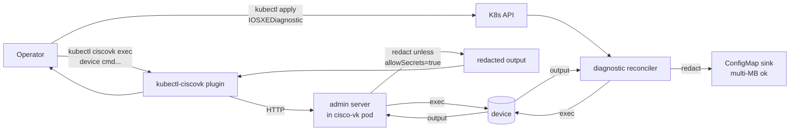

### 5.1 IOSXEDiagnostic CRD (declarative captures)

```yaml
apiVersion: config.cisco.vk/v1alpha1
kind: IOSXEDiagnostic
metadata:
  name: troubleshoot-bgp
  namespace: cisco-vk-smoke
spec:
  deviceRef:
    name: cat9k-smoke
  commands:
    - show ip bgp summary
    - show ip route 0.0.0.0
  schedule: "*/5 * * * *"   # cron, optional
  allowSecrets: false        # default; redact passwords/keys
  sinkRef:
    configMap:
      name: bgp-troubleshoot-output
```

### 5.2 kubectl plugin

```sh
kubectl ciscovk exec cat9k-smoke -- show running-config | section ospf
kubectl ciscovk tail cat9k-smoke              # last capture
kubectl ciscovk tail -f cat9k-smoke           # follow new captures
```

### 5.3 Redaction patterns
By default the diagnostic reconciler redacts six well-known secret patterns from output:

- `enable secret 5 ...`
- `username ... secret ...`
- `key chain ... key-string ...`
- `crypto pki ...` (private-key blocks)
- `aaa server-private ...` (key blocks)
- `radius-server key ...`

Operators with explicit need set `spec.allowSecrets: true` and the audit log records the access.

---

## 6. Observability

### 6.1 Metrics

Prometheus endpoint at `:8080/metrics` on every cisco-vk pod and the controller manager.

| Metric | Type | Labels | What it tells you |
|---|---|---|---|
| `cisco_vk_config_reconcile_duration_seconds` | histogram | device, family | per-tick wall time |
| `cisco_vk_config_apply_duration_seconds` | histogram | device, family | per-Apply wall time |
| `cisco_vk_config_drift_detected_total` | counter | device, family | Drifted-state transitions |
| `cisco_vk_config_transactions_total` | counter | device, transport, outcome | confirmed / committed / auto_reverted / discarded |
| `cisco_vk_config_mutate_ops_total` | counter | device, transport, verb | edit-config wire ops |
| `cisco_vk_config_save_startup_total` | counter | device, outcome | writeStartup outcomes |
| `cisco_vk_lease_acquire_total` | counter | device, family, outcome | lease arbitration |
| `cisco_vk_diagnostic_capture_duration_seconds` | histogram | device | IOSXEDiagnostic execution time |

Total cardinality scales as `O(devices × families × verbs)`. For a 100-device fleet × 50 families × 4 verbs, expect ~20K series for the busiest metric. Plan Prometheus retention accordingly.

### 6.2 Events

Per-CR Kubernetes events surface state transitions:

- `Normal AppliedSuccess` — Mutate succeeded.
- `Normal ConfirmedCommitUsed` — auto-revert path engaged + confirmed.
- `Warning ConfirmedCommitFallback` — requested but transport doesn't support; fell back to plain commit.
- `Warning ReconcileFailed` — apply or verify error.
- `Normal DriftDetected` — re-Fetch saw divergence from intent.
- `Normal LeaseAcquired` / `Warning LeaseBlocked` — arbitration outcomes.
- `Normal FamilySkipped` — lease held by another CR.

### 6.3 Status fields

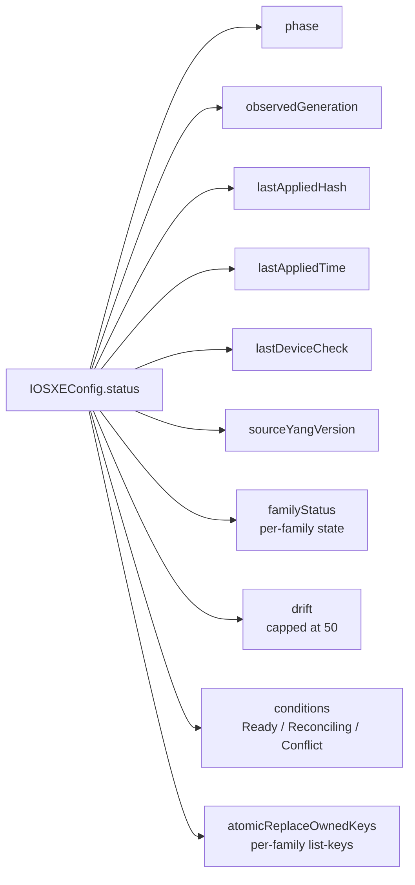

---

## 7. Operator playbook

### 7.1 Day-1 install

```sh
# Add helm repo
helm repo add cisco-open https://cisco-open.github.io/cisco-virtual-kubelet
helm repo update

# Install controller manager (cluster-scoped)
helm install cvk cisco-open/cisco-virtual-kubelet \
  --namespace cisco-vk-system \
  --create-namespace \
  --set image=containers.dmz.cisco.com:5000/pr/johalley/ciscoconfig_xe:v43 \
  --set controller.leaderElect=true \
  --set aggregator.enabled=false

# Verify
kubectl -n cisco-vk-system get deploy cvk-cisco-virtual-kubelet-controller
kubectl get crd | grep cisco
```

### 7.2 Day-1 first device

```yaml
# device-namespace, device-secret, device-CR
apiVersion: v1
kind: Namespace
metadata:
  name: cat9k-prod
---
apiVersion: v1
kind: Secret
metadata:
  name: cat9k-prod-creds
  namespace: cat9k-prod
data:
  password: <base64>
---
apiVersion: cisco.vk/v1alpha1
kind: CiscoDevice
metadata:
  name: cat9k-prod-1
  namespace: cat9k-prod
spec:
  driver: XE
  address: 10.0.10.1
  port: 443
  username: cisco-vk
  credentialSecretRef:
    name: cat9k-prod-creds
  tls:
    enabled: true
    insecureSkipVerify: false   # MUST be false in prod
    caCertSecretRef:
      name: corp-ca-bundle
  transport: netconf            # production default
  xe:
    networking:
      interface:
        type: Management
        management:
          dhcp: false
```

### 7.3 Day-2 first IOSXEConfig

```yaml
apiVersion: v1
kind: ConfigMap
metadata:
  name: cat9k-prod-1-baseline
  namespace: cat9k-prod
data:
  data.nac.yaml: |
    iosxe:
      devices:
        - name: cat9k-prod-1
          configuration:
            banner:
              motd: "Property of Acme. Authorized access only."
            system:
              hostname: cat9k-prod-1
              mtu: 9000
            vlan:
              vlans:
                - id: 100
                  name: prod-data
                - id: 200
                  name: prod-mgmt
---
apiVersion: config.cisco.vk/v1alpha1
kind: IOSXEConfig
metadata:
  name: cat9k-prod-1-baseline
  namespace: cat9k-prod
spec:
  deviceRef:
    name: cat9k-prod-1
  managedFamilies:
    - banner
    - system
    - vlan
  transactional: true
  confirmTimeoutSeconds: 30          # Wave 10 auto-revert
  atomicReplace: true                # intent authoritative for these families
  driftPolicy: revert                # remediate drift on detect
  driftDetectInterval: 5m
  source:
    configMapRef:
      name: cat9k-prod-1-baseline
      key: data.nac.yaml
```

Verify:

```sh
kubectl -n cat9k-prod get iosxeconfig
# NAME                    DEVICE         PHASE    DRIFT    AGE
# cat9k-prod-1-baseline   cat9k-prod-1   InSync   revert   2m

kubectl -n cat9k-prod describe iosxeconfig cat9k-prod-1-baseline | grep -E 'Events|Conditions' -A 10
```

### 7.4 Day-2 troubleshooting decision tree

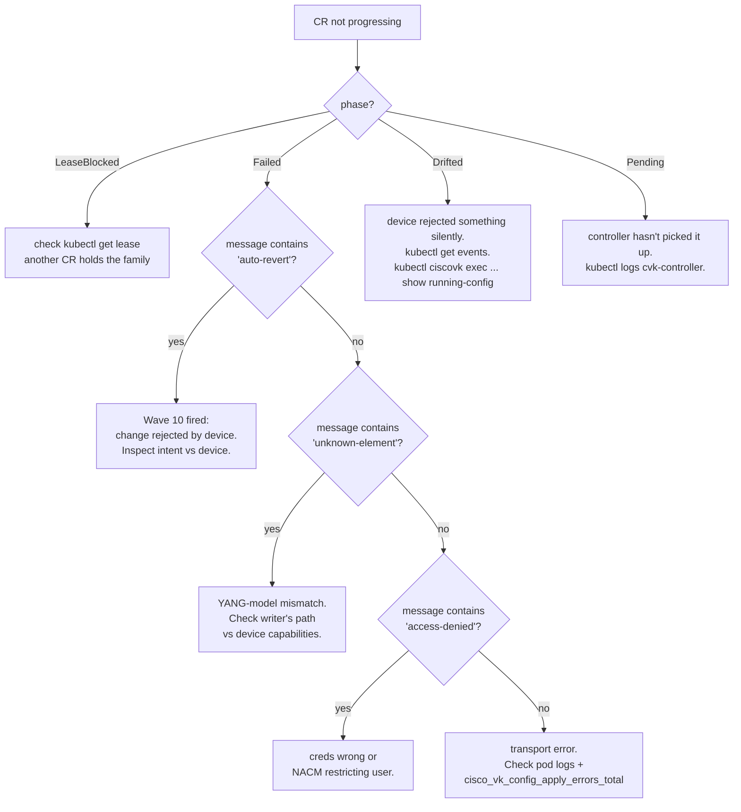

### 7.5 Day-2 transport flip (e.g. for gNMI Subscribe)

**The right way**:

```sh
kubectl -n cat9k-prod patch ciscodevice cat9k-prod-1 \
  --type=merge -p '{"spec":{"transport":"gnmi"}}'
# leave spec.port=443, spec.tls.enabled=true alone
```

**The wrong way** (don't do this):

```sh
kubectl ... patch ... -p '{"spec":{"transport":"gnmi","port":50052}}'
# breaks apphosting probe — fails the cisco-vk pod
```

If you're flipping to a non-default port (custom NETCONF or secure gnxi), set `spec.port` to the protocol-specific value AND understand that apphosting probe will fail. See the [transport-flip pattern](../deployment-modes.md#switching-spectransport--the-right-cr-shape-pattern).

---

## 8. Production hardening checklist

Before deploying to a real fleet, work through every box. The release-readiness evaluation has detail on each.

### Security
- [ ] `tls.insecureSkipVerify: false` on every CiscoDevice (no self-signed-cert acceptance).
- [ ] CA bundle deployed via `caCertSecretRef`.
- [ ] NETCONF host-key pinned via `NETCONFConfig.HostKeyCallback` (custom factory wiring; today's branch warns at every dial when unpinned).
- [ ] Per-device credential Secret in a tenant-scoped namespace; no shared "admin" creds across devices.
- [ ] RBAC reviewed: VK ServiceAccount has only the verbs in [`charts/cisco-virtual-kubelet/templates/vk-rbac.yaml`](../../../charts/cisco-virtual-kubelet/templates/vk-rbac.yaml).
- [ ] `IOSXEDiagnostic.spec.allowSecrets: false` enforced at admission (consider Kyverno/OPA).
- [ ] Audit log retention: `IOSXEConfigApplyLog` circular buffer sized for compliance retention window.

### Resilience
- [ ] Per-pod topology (`aggregator.enabled=false`) for blast-radius isolation.
- [ ] PodDisruptionBudget on the controller manager Deployment (chart gap; add manually).
- [ ] Liveness + readiness probes on cisco-vk pods (default templated).
- [ ] `gracefulShutdownSeconds` tuned per typical Mutate duration (chart gap; document).
- [ ] Backoff: rely on controller-runtime exponential 1s→10s; transport-level retries are pre-tag-tracked work.

### Observability
- [ ] Prometheus scrape config covers `:8080/metrics` on every cisco-vk pod and the controller.
- [ ] Dashboards: per-CR phase transitions, per-family apply duration histograms, lease contention rate.
- [ ] Alerts: `cisco_vk_config_drift_detected_total` rate-of-change > threshold, `cisco_vk_config_apply_errors_total` non-zero for >5m, `phase=Failed` count > threshold.
- [ ] Log aggregation: structured logs ingested + secret-redaction pipeline at the log collector (defense-in-depth; the engine doesn't yet redact passwords from error-message bodies).

### Upgrade
- [ ] CRD upgrade plan documented per [`crd-v1-promotion-plan.md`](../crd-v1-promotion-plan.md).
- [ ] Helm rollback tested in staging.
- [ ] CRD bumps applied separately from chart upgrade (CRDs aren't templated).
- [ ] Per-pod-kubelet image rolled before controller (or vice versa); test ordering in staging.

### Tenancy
- [ ] One namespace per device-tenant (network-team isolation).
- [ ] NetworkPolicy templates added (chart gap; manually deploy).
- [ ] Multi-cluster: per-cluster CRD set; use Kustomize overlays for fleet-wide vs site-local CRs.

---

## 9. Reference

### 9.1 CR field reference

The `crd-v1-promotion-plan.md` is the source of truth for CR shape evolution. Today's `v1alpha1` schema:

- [`api/cisco.vk/v1alpha1/ciscodevice_types.go`](../../../api/cisco.vk/v1alpha1/) — CiscoDevice
- [`api/config.cisco.vk/v1alpha1/iosxeconfig_types.go`](../../../api/config/v1alpha1/iosxeconfig_types.go) — IOSXEConfig
- [`api/config.cisco.vk/v1alpha1/iosxediagnostic_types.go`](../../../api/config/v1alpha1/iosxediagnostic_types.go) — IOSXEDiagnostic
- (others under `api/`)

Auto-generated reference: [`docs/reference/families/`](../../reference/families/).

### 9.2 Per-RFC index

| RFC | What it covers |
|---|---|
| [`architectural-review.md`](../architectural-review.md) | Watch-items #1–#12 |
| [`deployment-modes.md`](../deployment-modes.md) | Per-transport setup + transport-flip pattern |
| [`device-operations-rfc.md`](../device-operations-rfc.md) | Destructive-ops surface (clears / reload / write-erase); RBAC tiers; designed not yet coded |
| [`diagnostics-rfc.md`](../diagnostics-rfc.md) | IOSXEDiagnostic + `kubectl ciscovk` design |
| [`diagnostics-guide.md`](../diagnostics-guide.md) | Operator usage of diagnostics |
| [`operator-cli-guide.md`](../operator-cli-guide.md) | kubectl interaction reference |
| [`crd-v1-promotion-plan.md`](../crd-v1-promotion-plan.md) | v1alpha1 → v1 phasing + conversion webhook |
| [`log-unification-plan.md`](../log-unification-plan.md) | logrus + zap → slog migration |
| [`phase-8-residuals.md`](../phase-8-residuals.md) | External infrastructure (Terraform Registry, netascode portal-compat) |
| [`transport-architecture.md`](../transport-architecture.md) | RESTCONF / NETCONF / gNMI internals |
| [`iosxe-config-driver-review.md`](../iosxe-config-driver-review.md) | Phase 0–9 design intent |
| [`iosxe-config-driver-appraisal.md`](../iosxe-config-driver-appraisal.md) | Quality / composition snapshot |
| [`driver-extension-guide.md`](../driver-extension-guide.md) | Adding a new vendor driver (NX-OS, IOS-XR, OpenConfig) |
| [`release-readiness-evaluation.md`](./release-readiness-evaluation.md) | Pre-tag punch-list (today's deliverable) |

### 9.3 Live-device evidence
[`docs/rfcs/final/evidence/`](evidence/) — six retest bundles dated 2026-04-26 through 2026-04-28 documenting every test in the release-blocker playbook.

### 9.4 Test playbook
[`docs/rfcs/final/release-blocker-tests/`](release-blocker-tests/) — 12 operator-runnable test packages with `00-apply.yaml`, `expected.md`, `pre-state.sh`, `verify.sh`, `rollback.sh`. The single entry-point is [`RUNBOOK.md`](release-blocker-tests/RUNBOOK.md).

---

## 10. Support

- Issue tracker: <https://github.com/cisco-open/cisco-virtual-kubelet/issues>
- RFC discussion: open a PR against [`docs/rfcs/`](../) with a `draft` label.
- Operator quickstart: [`docs/getting-started.md`](../../getting-started.md).
