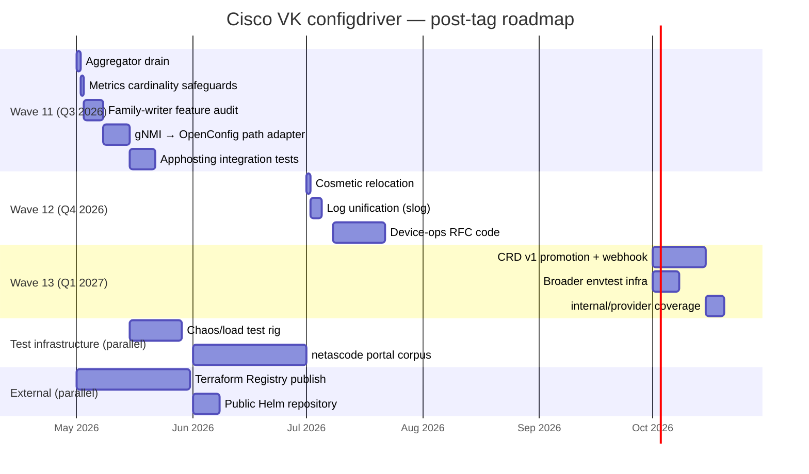

# Roadmap — `pr/johalley/ciscoconfig_xe` and beyond

This document is the canonical forward-looking plan for cisco-virtual-kubelet's configuration-driver subsystem after the `pr/johalley/ciscoconfig_xe` tag. It captures every deferred item from the [release-readiness evaluation](./release-readiness-evaluation.md) plus pre-existing items carried from `main`, organised by tier with priority + effort + dependencies + RFC pointer.

Use this as the input to:
- Quarterly planning for the cisco-vk maintainer team.
- Prioritisation of Wave 11+ scope.
- Onboarding documentation for new contributors who ask "what's next?"

**Statuses**:
- 🟢 **In code, in this branch** — shipped; documented for context only.
- 🟡 **Designed, RFC merged, not coded** — the design is canon; coding is the work.
- 🟠 **Deferred to Wave N** — explicit roadmap commitment.
- 🔵 **Watch-item** — known gap, no committed timeline.
- ⚪ **Unscoped** — needs design RFC before scope can be estimated.

---

## Tier 1 — release-tag prerequisites (closed)

These items were the must-fix list in the readiness review. All closed in-session. Listed here so the roadmap captures the complete arc of pre-tag work.

| Item | Status | Commit |
|---|---|---|
| Credential redaction in transport error logs | 🟢 | `7ee3362` (this branch) |
| NETCONF host-key warn-on-default | 🟢 | `35ee76f` |
| NETCONF known_hosts loader helper | 🟢 | `7ee3362` |
| Wave 10 confirmed-commit + auto-revert | 🟢 | live-validated 2026-04-28 |
| Wave 10 atomic-replace cross-family scoped pruning | 🟢 | live-validated 2026-04-28 |
| ConfigReconciler graceful-shutdown drain | 🟢 | `7ee3362` |
| Transport-level retry on transient errors | 🟢 | `7ee3362` |
| PodDisruptionBudget / NetworkPolicy / ServiceMonitor chart templates | 🟢 | `7ee3362` |
| Test 04 transport-flip mechanism (apphosting + configdriver coexist) | 🟢 | `23a13f8` |
| `go vet ./...` clean | 🟢 | `35ee76f` |

---

## Tier 2 — release-tag-acceptable but planned post-tag (Wave 11)

Items the readiness review classified as "should-fix-but-not-blocking". Each has a documented design path; effort estimates are calibrated against the work pattern of the corresponding Wave 10 / Wave 9 PRs.

### 2.1 Aggregator-mode graceful drain
- **Status**: 🟠 Wave 11 (~½ engineer-day).
- **What**: Mirror today's `ConfigReconciler.GracefulShutdownTimeout` drain into the aggregator's per-fleet `Run` loop. Per-pod topology already has it; aggregator topology kills all device reconciles on manager pod restart.
- **Dependency**: none (refactor of existing aggregator code).
- **RFC**: not separate; falls under [`deployment-modes.md`](../deployment-modes.md) §"Aggregator topology trade-offs".

### 2.2 gNMI → OpenConfig path adapter on writer side
- **Status**: 🟠 Wave 11 (~1 engineer-week).
- **What**: Today's `interface_ethernet` and other Phase-1 family writers bind to `Cisco-IOS-XE-native:native/...` paths. Devices whose gnxi server advertises only the OpenConfig YANG model (e.g. C9K-4 / IOS-XE 17.18.2 in this branch's lab) reject those paths. A per-transport YANG-model adapter at the writer→transport boundary lets the same family writer target either model based on transport capability + device YANG-library advertisement.
- **Dependency**: capability discovery from NETCONF `<get-schema>` / yang-library 1.1 endpoint (envtest harness for the discovery flow exists in transport package). The Wave 5A-fu / 7B gNMI Set wire encoding is already validated in envtest.
- **RFC**: extends [`driver-extension-guide.md`](../driver-extension-guide.md) §7 (cosmetic relocation enabler) with a new "Per-transport YANG-model adapter" sub-RFC.
- **Closes**: live retest of test 04 (`docs/rfcs/final/release-blocker-tests/04-gnmi-keyed-path/`). Today's branch validates the transport-flip mechanism; the path adapter is the last layer.

### 2.3 Metrics cardinality safeguards
- **Status**: 🟠 Wave 11 (~½ engineer-day).
- **What**: Today's metrics label by `device + family + verb`; for a 1000-device fleet × 50+ families × 4 verbs that's ~200K series for the busiest histograms. Add a `--metrics-cardinality-limit` flag with sane defaults; document recommended Prometheus retention in the production guide.
- **Dependency**: none.
- **RFC**: extends [`production-deployment-guide.md`](./production-deployment-guide.md) §6.1 with cardinality math + tuning guidance.

### 2.4 Apphosting integration tests
- **Status**: 🟠 Wave 11 (~1 engineer-week).
- **What**: Pre-existing 6.3% coverage in [`internal/drivers/iosxe/`](../../../internal/drivers/iosxe/) (apphosting driver, pod_lifecycle, status_transforms) is carried unchanged from `main`. Today's branch added a transport-flip coupling that warrants regression tests pinning that `transport: gnmi` + `tls.enabled: true` doesn't break the apphosting connectivity probe.
- **Dependency**: none (pre-existing scope).
- **RFC**: file as a separate `apphosting-coverage-uplift.md` PR.

### 2.5 Family-writer feature audit + completion
- **Status**: 🟠 Wave 11 (~3 engineer-days, family-by-family).
- **What**: Today's session surfaced multiple writer-completeness gaps under the live retest microscope (VRF address-family, ip_access_group_in/out, ACL rule body translator, key URL-encoding, scoped atomic-replace ownedKeys). All eight P-1 / P-2 enhancement-class fixes landed in commits `78ccc64..b38012e`. The audit exercise should sweep the remaining ~50 families for similar gaps before they're surfaced ad-hoc by the next operator's first apply.
- **Dependency**: none.
- **RFC**: extends [`iosxe-config-driver-review.md`](../iosxe-config-driver-review.md) Phase 1 audit table.

---

## Tier 3 — Architectural watch-items (planned multi-Wave)

Items from [`architectural-review.md`](../architectural-review.md) that the original review flagged as multi-Wave forward work. None blocks merge; all gate fleet-scale production rollout.

### 3.1 CRD v1alpha1 → v1 promotion + conversion webhook
- **Status**: 🟠 ~2 engineer-weeks (release-cut branch).
- **What**: Promote all 9 CRDs from `v1alpha1` to `v1` with a 3-release phasing (per [`crd-v1-promotion-plan.md`](../crd-v1-promotion-plan.md)). Adds a conversion webhook deployment, stored-version migration, and a CRD-controller readiness check.
- **Dependency**: lands with broader envtest infrastructure (item 3.2 below).
- **RFC**: [`crd-v1-promotion-plan.md`](../crd-v1-promotion-plan.md) — phasing + webhook design merged.

### 3.2 Broader envtest infrastructure
- **Status**: 🟠 ~1 engineer-week (lands with #3.1).
- **What**: Today's `make test-envtest` runs 9 cases against a real apiserver + etcd. Broader controller-runtime coverage (predicate scenarios, watch establishment, cross-tenant lease arbitration) waits for the conversion-webhook PR's harness changes.
- **Dependency**: #3.1.
- **RFC**: same.

### 3.3 Cosmetic relocation `internal/drivers/iosxe/configdriver/...` → `internal/configdriver/...`
- **Status**: 🟠 ~½ engineer-day (mechanical).
- **What**: The `engine/`, `intent/`, `schema/`, and most of `transport/` are platform-agnostic. They live under the IOS-XE driver path because that's where the original platform-specific work began. Cosmetic relocation makes the boundary explicit + lets future vendor drivers (NX-OS, IOS-XR, OpenConfig) reuse the same engine without an awkward import path.
- **Dependency**: best landed when no other PRs are in flight (touches every import).
- **RFC**: [`driver-extension-guide.md`](../driver-extension-guide.md) §7.

### 3.4 Log unification (logrus + zap → `slog` shims)
- **Status**: 🟠 ~3 engineer-days.
- **What**: Replace dual logrus + zap usage with `slog` shims. Operators get one log format across the controller manager and per-pod kubelets.
- **Dependency**: none.
- **RFC**: [`log-unification-plan.md`](../log-unification-plan.md).

### 3.5 Device-operations CRDs (clears / reload / write-erase)
- **Status**: 🟠 ~2 engineer-weeks.
- **What**: Implement `IOSXEMaintenance`, `IOSXEDeviceOp`, `IOSXEDeviceOpAuditLog` per [`device-operations-rfc.md`](../device-operations-rfc.md). RBAC tiers + two-person rule for destructive ops (clears, reload, write-erase). Designed not yet coded.
- **Dependency**: none — the design is canon.
- **RFC**: [`device-operations-rfc.md`](../device-operations-rfc.md).

### 3.6 Aggregator-mode live retest
- **Status**: 🔵 Watch-item (~½ engineer-day to run; never run live).
- **What**: Aggregator topology (`aggregator.enabled=true`) is opt-in. Code path is exercised by envtest but never run end-to-end against a live fleet. Maintenance-window retest needed before any operator opt-in.
- **Dependency**: none.
- **RFC**: [`deployment-modes.md`](../deployment-modes.md) §"Aggregator topology".

### 3.7 `internal/provider` package coverage uplift (36% → 70%+)
- **Status**: 🔵 Watch-item (~3 engineer-days).
- **What**: ConfigReconciler + ApplyLog replay + lease-acquisition + status-writeback are the most-frequently-executed code paths in production. Today's coverage has gaps surfaced by the readiness review.
- **Dependency**: lands with #3.1 / #3.2 envtest infra (avoids harness duplication).
- **RFC**: same.

---

## Tier 4 — Test infrastructure (separate work-stream)

Items that need a separate test rig or harness; not single-PR scope.

### 4.1 Chaos / load test rig
- **Status**: 🟠 ~2 engineer-weeks.
- **What**: Network-namespace harness or fault-injection proxy (toxiproxy / chaos-mesh). Test scenarios:
  - 100s of IOSXEConfigs against a fleet.
  - Slow device (artificial latency on management network).
  - Transient network loss mid-Mutate.
  - Two pods racing for the same family lease (with the runtime-suffixed identity that prevents same-pod conflict and the TTL-based recovery path the readiness review flagged).
- **Dependency**: shared harness with item 4.2 (similar fake-device infrastructure).
- **RFC**: file a `test-infrastructure.md` RFC.

### 4.2 netascode portal-compat example corpus
- **Status**: 🟠 ~80 engineer-hours (per [`phase-8-residuals.md`](../phase-8-residuals.md)).
- **What**: Per-family pages with operator-validated example fragments. Structure shipped under [`docs/reference/families/`](../../reference/families/); content authoring + lab validation remains.
- **Dependency**: item 2.5 (family-writer audit) surfaces which families have the most operator-friction examples.
- **RFC**: [`phase-8-residuals.md`](../phase-8-residuals.md).

### 4.3 Per-feature unit-test gap closure
- **Status**: 🔵 Watch-item.
- Listed by package per the readiness review. None blocks tag.

| Package | Coverage | Notes |
|---|---|---|
| `internal/provider` | 36.4% | ConfigReconciler + ApplyLog replay; lands with #3.1 envtest harness |
| `internal/drivers/iosxe` | 6.3% | Pre-existing apphosting code; #2.4 |
| `internal/drivers/iosxe/configdriver/transport` | 66.9% | NETCONF candidate-only mode + gNMI Subscribe + error-recovery; ~3 eng-days table-driven scenario tests |
| `internal/aggregator` | 64.8% | Lands with #3.6 aggregator live retest |
| `internal/controller` | 69.2% | Pre-existing CiscoDeviceReconciler; envtest uplift |

---

## Tier 5 — External infrastructure (post-merge, pre-release-announcement)

Per [`phase-8-residuals.md`](../phase-8-residuals.md), neither blocks merge; both should land before any release announcement.

### 5.1 Terraform Registry publish for `cisco-open/iosxeconfig`
- **Status**: 🟠 paperwork + ~1 engineer-week (per phase-8-residuals).
- **What**: Provider implementation is feature-complete. Missing: Cisco/HashiCorp publisher account, GPG signing key in corporate KMS, `.github/workflows/terraform-release.yml` for multi-arch build/sign/publish, Hashicorp-layout provider docs.
- **Dependency**: paperwork.
- **RFC**: [`phase-8-residuals.md`](../phase-8-residuals.md).

### 5.2 Public Helm repository
- **Status**: 🔵 Watch-item.
- **What**: Today's chart lives in-tree at [`charts/cisco-virtual-kubelet/`](../../../charts/cisco-virtual-kubelet/). Operators install via `helm install -f values.yaml ./charts/...`. A public chart-repository (chart museum / GitHub Pages helm-publish action) lets operators install without cloning.
- **Dependency**: none, but coordinate with #5.1 for consistent release cadence.
- **RFC**: not yet filed.

---

## Tier 6 — Doc-only items (theoretical concerns from readiness review)

The readiness review flagged a few items as "theoretical only — outer mechanism already covers it". Documenting here so the roadmap captures the closure rationale.

### 6.1 SaveStartup dedup-by-hash
- **Status**: 🟢 closed (doc-only).
- **What**: The outer reconciler's `lastAppliedHash` short-circuit at [`config_reconciler.go:441`](../../../internal/provider/config_reconciler.go#L441) prevents repeat reconciles for the same intent. SaveStartup-within-a-tick is single-call. The double-save concern is theoretical.
- **Action**: documented in [`production-deployment-guide.md`](./production-deployment-guide.md) §3.3.

### 6.2 Lease TTL race window
- **Status**: 🟢 closed (doc-only).
- **What**: TTL is 60s vs typical Mutate of ~5s. Probability of a hung pod racing a successor's Mutate is extremely small; the device's confirmed-commit safety net catches the pathological case.
- **Action**: documented in [`production-deployment-guide.md`](./production-deployment-guide.md) §7.4.

### 6.3 ApplyLog replay deduplication
- **Status**: 🔵 Watch-item.
- **What**: If the same applylog entry replays twice (operator triggers replay after a status-only failure), the device gets two identical operations. Side-effect idempotency (writer-guaranteed for VerbMerge, VerbReplace) covers most cases, but state-bearing operations like `clear counters` would double-fire if exposed via applylog.
- **Action**: defer until [`device-operations-rfc.md`](../device-operations-rfc.md) lands (clears are device-ops territory; applylog won't carry them).

---

## Forward roadmap calendar (suggested)

Approximate sequencing for a maintainer team. Adjust to your team's bandwidth.

This calendar assumes one full-time maintainer; teams of two or more can compress meaningfully.

---

## How to update this doc

When a roadmap item lands, change its status from 🟠 → 🟢 and add the closing commit reference. When a new item is identified, add it to the appropriate tier with priority + effort + dependencies + RFC pointer. The structure is meant to be edited inline — keep tiers stable, edit items.

When a Wave closes, add a "post-Wave-N retrospective" stanza at the bottom of this file capturing what landed early, what slipped, and why. The Wave 10 retrospective is in [`evidence/2026-04-28-live-c9300-release-blockers/SUMMARY.md`](evidence/2026-04-28-live-c9300-release-blockers/SUMMARY.md).

---

## Related documents

| Doc | Role |
|---|---|
| [`README.md`](./README.md) | Single-page architectural reference + cross-link index |
| [`production-deployment-guide.md`](./production-deployment-guide.md) | Operator-facing reference + day-1/day-2 playbook + hardening checklist |
| [`release-readiness-evaluation.md`](./release-readiness-evaluation.md) | Pre-tag punch-list + post-readiness-review fixes table |
| [`release-blocker-tests/RUNBOOK.md`](./release-blocker-tests/RUNBOOK.md) | 12 operator-runnable live-device test packages |
| [`evidence/`](./evidence/) | Live-device retest evidence bundles |

For the per-RFC index see [`README.md`](./README.md) §8 "Cross-references".
