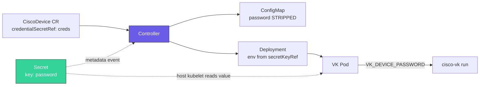

# Security

This page covers credential handling, TLS configuration, and the RBAC model.

## Credential injection

With `credentialSecretRef`, the controller keeps device credentials out of the
`CiscoDevice`, generated ConfigMap, and literal Deployment environment values:

1. Before the `DeviceSpec` is marshalled into the ConfigMap, both `password` and `credentialSecretRef` are stripped.
2. The VK pod's Deployment gets `VK_DEVICE_PASSWORD` as an environment variable sourced from a Secret via `valueFrom.secretKeyRef`.
3. To roll the VK pod when credentials rotate, the manager watches referenced
   Secrets and reads their `resourceVersion`. Reconciliation does not inspect
   `.data`, but the typed Secret objects entering the manager cache/API client
   still contain that data. Treat the manager's Secret RBAC and memory as part
   of the credential trust boundary.

Kubernetes Secret objects are still stored in etcd. Base64 encoding is not
encryption; enable Kubernetes
[encryption at rest](https://kubernetes.io/docs/tasks/administer-cluster/encrypt-data/)
and restrict Secret RBAC for production clusters.



### Recommended: Secret + `credentialSecretRef`

```yaml
apiVersion: v1
kind: Secret
metadata:
  name: cat9000-1-creds
  namespace: default
type: Opaque
stringData:
  password: <device-password>
```

```yaml
apiVersion: cisco.vk/v1alpha1
kind: CiscoDevice
metadata:
  name: cat9000-1
  namespace: default
spec:
  driver: XE
  address: "192.168.1.100"
  username: admin
  credentialSecretRef:
    name: cat9000-1-creds
  # ... remaining spec
```

**Rules:**

- The Secret **must be in the same namespace** as the `CiscoDevice`.
- The Secret key **must be named `password`** — this is hardcoded in the controller.
- Any Secret type works (`Opaque`, `kubernetes.io/basic-auth`, …) as long as it has a `password` key.
- Multiple `CiscoDevice`s can point at different Secrets — credentials are per-device.

### Legacy fallback: inline password

If `credentialSecretRef` is not set **and** `password` is non-empty, the controller injects it directly as an env var value (still scrubbed from the ConfigMap):

```yaml
spec:
  password: cisco123   # discouraged — only for dev/test
```

This remains for backward compatibility. The password is still visible in the `Deployment` spec (`kubectl get deploy -o yaml`), so Secret refs are strongly preferred in production.

### VK_DEVICE_PASSWORD precedence

The VK pod reads the device password from the `VK_DEVICE_PASSWORD` environment variable, which the controller injects on the Deployment it creates (sourced from the Secret referenced by `credentialSecretRef`). The password field in the rendered ConfigMap is always empty — the env var is the sole source of truth inside the pod.

### Rotating a single password

To rotate a device password without recreating the `CiscoDevice`:

```bash
# 1. Change the password on the device
# 2. Update the Secret
kubectl patch secret cat9000-1-creds --type merge \
  -p '{"stringData":{"password":"new-password"}}'
# 3. The Secret watch updates the pod-template annotation and rolls the VK pod
kubectl -n default rollout status deploy/cat9000-1-vk
```

The controller maps a referenced Secret event back to every affected
`CiscoDevice` and places that Secret's current `resourceVersion` in the pod
template's `cisco.vk/credential-resource-version` annotation. A Secret update
therefore creates a Deployment rollout automatically; `cisco.vk/config-hash`
continues to cover ConfigMap changes. See [Managing credentials across multiple
devices → Bulk rotation](#bulk-rotation) for fleet-wide workflows.

### Managing credentials across multiple devices

Each `CiscoDevice` is independent: it declares its own `username` inline in the spec and points at its own Secret for the password. That means any combination of shared or distinct credentials is supported.

#### Pattern 1 — one Secret per device (different credentials)

The safest default. Every device gets its own Secret, even if the credentials happen to match today. A compromised or rotated password affects only one device.

```yaml
apiVersion: v1
kind: Secret
metadata:
  name: cat9000-edge-01-creds
  namespace: edge
stringData:
  password: <unique-password-1>
---
apiVersion: v1
kind: Secret
metadata:
  name: cat9000-edge-02-creds
  namespace: edge
stringData:
  password: <unique-password-2>
---
apiVersion: cisco.vk/v1alpha1
kind: CiscoDevice
metadata:
  name: cat9000-edge-01
  namespace: edge
spec:
  username: admin-edge-01
  credentialSecretRef:
    name: cat9000-edge-01-creds
  # ...
---
apiVersion: cisco.vk/v1alpha1
kind: CiscoDevice
metadata:
  name: cat9000-edge-02
  namespace: edge
spec:
  username: admin-edge-02
  credentialSecretRef:
    name: cat9000-edge-02-creds
  # ...
```

Rotate one device's password without touching any other.

#### Pattern 2 — shared Secret across a fleet (identical credentials)

When a group of devices share credentials (for example, lab devices behind the same TACACS/AAA profile), a single Secret can serve all of them. Each `CiscoDevice` references the same `credentialSecretRef`.

```yaml
apiVersion: v1
kind: Secret
metadata:
  name: lab-fleet-creds
  namespace: lab
stringData:
  password: <shared-password>
---
apiVersion: cisco.vk/v1alpha1
kind: CiscoDevice
metadata:
  name: lab-cat8kv-01
  namespace: lab
spec:
  username: admin       # same username across the fleet
  credentialSecretRef:
    name: lab-fleet-creds
  # ...
---
apiVersion: cisco.vk/v1alpha1
kind: CiscoDevice
metadata:
  name: lab-cat8kv-02
  namespace: lab
spec:
  username: admin
  credentialSecretRef:
    name: lab-fleet-creds   # same Secret as above
  # ...
```

Useful for bulk rotation — one Secret patch propagates to every device that references it. Trade-off: a compromised password affects the whole fleet.

#### Pattern 3 — same password, different usernames

Username is in the spec, not the Secret, so devices can share a password Secret while declaring different usernames.

```yaml
apiVersion: cisco.vk/v1alpha1
kind: CiscoDevice
metadata: { name: dev-01, namespace: dev }
spec:
  username: operator-a
  credentialSecretRef: { name: shared-creds }
---
apiVersion: cisco.vk/v1alpha1
kind: CiscoDevice
metadata: { name: dev-02, namespace: dev }
spec:
  username: operator-b
  credentialSecretRef: { name: shared-creds }
```

#### Namespace boundaries

The Secret **must be in the same namespace** as the `CiscoDevice`. Kubernetes' own kubelet (on the real cluster node hosting the VK pod) resolves `secretKeyRef` at pod-start time; the controller has no mechanism to read cross-namespace Secrets.

Use this as a security boundary — a team owning `namespace=edge-team-a` cannot read Secrets in `namespace=edge-team-b`, so their CiscoDevices cannot reference the other team's credentials even by name.

If you want the same password in two namespaces, duplicate the Secret (ideally managed by External Secrets Operator, Sealed Secrets, or your GitOps tooling).

#### Bulk rotation

| Scenario | Approach |
|---|---|
| Rotate one device | Patch its Secret; the controller automatically rolls the referencing VK Deployment. Verify with `kubectl rollout status deploy/<device>-vk`. |
| Rotate a shared Secret (Pattern 2) | Patch it once; the Secret watch reconciles and rolls every referencing VK Deployment in that namespace. |
| Rotate the whole namespace | Update each Secret; wait for the affected Deployments to complete their automatic rollouts. |

If the automatic rollout does not begin, confirm that the manager is healthy,
the `CiscoDevice` still references the updated same-namespace Secret, and the
Deployment's `cisco.vk/credential-resource-version` matches the Secret's
`metadata.resourceVersion`. A manual `kubectl rollout restart` is a
troubleshooting fallback, not the normal rotation path.

#### GitOps and external secret managers

The `credentialSecretRef` field takes a reference to any Kubernetes `Secret`, regardless of how it was created. Common workflows:

- **Sealed Secrets** — commit encrypted Secrets to Git; controller in the cluster decrypts them into real Secrets.
- **External Secrets Operator** — point at HashiCorp Vault, AWS Secrets Manager, Azure Key Vault, GCP Secret Manager, etc.; ESO syncs them into Kubernetes Secrets.
- **SOPS / git-crypt** — encrypted manifests in Git, decrypted on apply.

All of these produce a normal `Secret` resource with a `password` key, which is what `credentialSecretRef` needs. No change to CiscoDevice is required.

## Hosted-application credentials

Environment values sourced through `SecretKeyRef` are resolved by the VK and
delivered to the hosted application as Docker run options. They are therefore
also visible to an administrator with permission to inspect app-hosting
configuration on the device. Grant pod-creation and device-administration
rights accordingly.

Environment-variable names must use the portable
`[A-Za-z_][A-Za-z0-9_]*` form. Although newer Kubernetes API validation admits
a broader printable character set, CVK rejects those relaxed names before
device access because IOS XE and NX-OS both render names into Docker run
options. Rename variables containing dashes, dots, spaces, or other punctuation
before deploying them through CVK.

CVK does not include resolved run options in controller logs or reconciliation
errors. The IOS XE app-hosting RESTCONF client and the NX-OS NX-API client also
reject HTTP redirects and omit free-form device response text from errors where
it could echo app-hosting data. Length-validation errors report only the
measured and supported sizes. IOS XE image-copy logging strips URL user
information, query parameters, and fragments while still sending the original
authenticated source to the device.

On NX-OS, a pod's `image` value is treated as untrusted CLI input. CVK accepts
only a single validated `bootflash:` path or HTTP(S) URL token before issuing
an app-hosting install command; whitespace, control characters, command
separators, user information, and other unsafe syntax are rejected before any
NX-API request. Prefer pre-staged `bootflash:` packages for production use.

NX-OS environment values are likewise validated before CLI rendering. The
current transport accepts printable ASCII values except semicolons, pipes,
quotes, backslashes, and backticks; it also rejects control characters and
non-ASCII text. JSON documents, PEM blocks, generated passwords, or other
values containing those characters must be delivered to the application by a
different mechanism until an NX-OS-native quoting strategy is validated.

The IOS XE `cisco.io/apphost-package-dest` annotation accepts only
`bootflash:`, `harddisk:`, `flash:`, `nvram:`, or `usb:` followed by path
segments using ASCII letters, digits, `-`, `.`, `_`, or `~`. Empty, `.` and
`..` segments are rejected. Rename existing destination paths containing
spaces, `+`, control characters, or other punctuation before upgrading.

## TLS

Device-side TLS is configured under `spec.tls`:

```yaml
spec:
  tls:
    enabled: true
    insecureSkipVerify: false
    caFile: /etc/ssl/certs/corp-ca.crt
    certFile: /etc/ssl/cvk/client.crt
    keyFile: /etc/ssl/cvk/client.key
```

| Field | Notes |
|---|---|
| `enabled` | Turn on HTTPS. Required in production. |
| `insecureSkipVerify` | `true` disables certificate verification. Acceptable for lab devices with self-signed certs; **do not** use in production. |
| `caFile` | Trust anchor for verifying the device certificate. |
| `certFile`, `keyFile` | Optional client certificate — required only if the device enforces mutual TLS. |

The `certFile` / `keyFile` / `caFile` paths refer to files **inside the VK pod**. Mount them with a Secret-backed volume or a configMap-backed volume on the VK Deployment. The controller does not currently auto-mount them — you'll need a post-install patch or a forked chart.

All TLS-enabled device-facing clients honour the full `spec.tls` block through
one shared builder: apphosting RESTCONF, the configdriver RESTCONF fallback,
MDT-over-gNMI telemetry, gNOI, and the NX-API client on NX-OS. A `caFile`
therefore gives you verified TLS on every path — `insecureSkipVerify: true` is
never required just because a device uses a private CA. A gNOI
`transportSecurity: tls` setting uses these trust and client-certificate fields
even if the general `tls.enabled` switch is off.

### Secure IOS-XE gNOI

With explicit `gnoi.transportSecurity: tls`, CVK sends the device username and
password as separate per-RPC metadata fields over verified TLS;
`insecureSkipVerify: true` is rejected. Pre-existing configurations that do not
opt in retain their legacy HTTP Basic metadata behavior, including on plaintext
listeners, solely for compatibility. Migrate them to explicit secure gNOI.
Avoid metadata logging and limit access to the credential Secret.

The dedicated provisioning Secret always supplies `tls.crt` and `ca.crt`.
`bootstrap.crt` is an optional exact pin for the temporary IOS-XE leaf, and
`ca.key` is used only by the gated `ProvisionCertificate` action. Both are
projected only while write-class gNOI is enabled. The signing key must belong
to a dedicated intermediate CA; root keys are rejected. Enable Secret
encryption at rest, restrict Secret reads and pod exec, and audit both.
Secret projection is not an authorization boundary: the standard VK
ClusterRole can read Secrets cluster-wide so VK nodes can serve pod volumes.
After provisioning is verified, promptly remove `ca.key` and `bootstrap.crt`
and disable the write-class gate. Keep the public certificate and CA bundle for
read-only gNOI trust. Deployments that have mounted the signer retain a
non-overlapping `Recreate` rollout strategy so a signer-bearing process cannot
overlap its replacement during cleanup.

The installed identity and CA bundle are scoped to gNOI in CVK, but IOS-XE
shares them with gNMI. Installation can restart gNXI, replace peer trust, and
change the server certificate seen by other clients; schedule it as a device
change. CVK does not reconfigure RESTCONF, NETCONF, app-hosting, or telemetry
client settings, so ensure every gNMI client already trusts the new issuer.

See the [secure gNOI and CSR provisioning workflow](gnoi-software-lifecycle.md#secure-ios-xe-gnxi)
for the complete Secret contract, one-shot action, trust-bundle warning, and
verification sequence.

### SSH host keys

NETCONF and the CLI side-channel ride SSH, not TLS. Pinning uses a standard
OpenSSH `known_hosts` file (multi-host files cover a fleet). Ship it into the
VK pod with a Secret- or ConfigMap-backed volume and point
`CONFIG_SSH_KNOWN_HOSTS` at the mounted path; the NETCONF diagnostic probe
(`CONFIG_NETCONF_PROBE`) then pins its dials against it and refuses to dial
unpinned if the file fails to load. Without the variable the probe keeps the
historical lab default of accepting any presented key — as with
`insecureSkipVerify`, do not rely on that in production.

### Kubelet-side TLS

The VK runs its own HTTPS listener on `:10250` (serving the kubelet API surface). By default it auto-generates a self-signed cert on every start into `/var/lib/virtual-kubelet/`. Override with:

```
--tls-cert-file /etc/kubelet/tls.crt
--tls-key-file  /etc/kubelet/tls.key
```

On k3s clusters that reject self-signed kubelet certs, set `kubelet-certificate-authority=""` in `/etc/rancher/k3s/config.yaml` to accept them — this is required for `kubectl logs` / `kubectl top` against the VK node.

## RBAC model

The Helm chart installs the manager and VK service accounts plus the reusable
ClusterRoles needed by isolated runtimes. The manager creates a unique service
account for each network-controller worker when that runtime is requested.

### Controller service account (`cisco-virtual-kubelet-controller`)

Used by the `manager` pod. Permissions (from kubebuilder markers):

| Resource | Verbs | Scope |
|---|---|---|
| `cisco.vk/ciscodevices` | get, list, watch, update, patch | cluster |
| `cisco.vk/ciscodevices/status` | get, update, patch | cluster |
| `configmaps` | get, list, watch, create, update, patch, delete | cluster |
| `secrets` | get, list, watch | cluster; used for `CiscoDevice` credential-rotation watches and by the optional in-process config aggregator; installed unconditionally |
| `deployments` (`apps`) | get, list, watch, create, update, patch, delete | cluster |
| `nodes` | get, list, watch, delete | cluster |

The network-controller orchestration path does not request Secret values: it
writes only authorized references into Pod volume sources, and the kubelet
resolves them. However, the shared manager ServiceAccount has cluster-wide
read-only Secret permission, the `CiscoDevice` reconciler watches typed Secret
objects for credential rotation, and the optional in-process aggregator also
uses the grant. Consequently Secret data can enter the manager process/cache
even when network-controller workers consume only projected files. The grant
is generated and installed even when aggregator mode and the optional
network-controller scaffold are off.

### VK pod service account (`cisco-virtual-kubelet`)

Used by each VK pod. Permissions:

| Resource | Verbs | Rationale |
|---|---|---|
| `pods`, `pods/status`, `pods/logs`, `pods/exec` | get, list, watch, create, update, patch, delete | VK provider API |
| `nodes`, `nodes/status` | get, list, watch, create, update, patch, delete | Register and update the virtual node |
| `configmaps`, `secrets` | get, list, watch | Read-only for pod volume mounts |
| `services` | get, list, watch | Service discovery surface for pods |
| `persistentvolumes`, `persistentvolumeclaims` | get, list, watch | Not used directly today; reserved for future volume support |
| `events` | create, patch | Emit pod lifecycle events |
| `leases` (in `kube-node-lease`) | get, list, watch, create, update, patch, delete | Node heartbeat via Lease API |

### Network-controller CRD validation prerequisite

The controller APIs use CEL transition rules (`oldSelf`) to enforce immutable
endpoint and intent identity. Kubernetes 1.28 is supported only with the
`CustomResourceValidationExpressions` feature gate enabled; that feature is
beta and enabled by default in 1.28. It is GA in Kubernetes 1.29 and later.
CVK's runtime validation is defense in depth for the current object shape, but
it cannot compare the previous object and does not replace CEL immutability.
Do not operate controller workers on an API server where CEL transition
validation is disabled.

### Network-controller worker service accounts

Each `NetworkController` gets a unique ServiceAccount and a **namespaced**
RoleBinding to the reusable
`cisco-virtual-kubelet-controller-worker` ClusterRole. There is deliberately no
ClusterRoleBinding. The worker can read controller resources, controller
intent, and source ConfigMaps across its namespace; update only the two CRDs'
`/status` subresources; and emit bounded Events. The base role deliberately has
no coordination Lease permission. It cannot update or patch either main
resource, including its spec, metadata, and finalizers. It also cannot read
Secrets, Nodes, Pods, workloads, or another namespace.

A unique worker ServiceAccount provides distinct identity and auditing, not
endpoint-scoped authorization. Its RoleBinding authorizes update/patch of the
`/status` subresource for **every** `NetworkController` and
`NetworkControllerConfig` in the namespace, not just the endpoint named in its
bootstrap. The endpoint object cache is name-filtered and the common contract
gate constrains a conforming adapter, but neither is an authorization boundary;
configuration/source caches and the RoleBinding remain namespace-scoped. The
namespace is therefore the Kubernetes API trust, RBAC, status-write, and cache
boundary. Per-endpoint workers separately isolate process lifetime, mounted
credentials, native sessions, failure, and rate limits. Use one
`NetworkController` per dedicated namespace whenever endpoints, adapter code,
or configuration authors are not mutually trusted.

Within one namespace, the manager fences multiple controller objects whose
stored `spec.endpoint` values are exactly equal. The deterministic owner is the
earliest creation timestamp, then lexicographically smallest name, then UID;
non-owners remain quiesced and periodically requeue so they can activate after
owner deletion. The elected owner must actively remove every managed loser
worker before it can start its own, so delayed peer events cannot permit an
overlap. This first guard deliberately does not normalize URLs or detect
equivalent endpoints across namespaces or clusters, so those stronger identity
policies remain an operational and future-design responsibility.

A future per-controller cache optimization may use a manager-owned
key-existence label such as `nc.cisco.vk/<uid-hash>: "true"` on configs and
source objects; a shared ConfigMap may carry several controller keys.
Manager-owned stamping/cleanup and a bounded, collision-tested UID hash are
prerequisites. This can reduce watch fan-out and memory, but it is non-security
work: labels and cache filters do not reduce the namespace-wide API authority
described above.

The manager associates worker resources with their endpoint by explicit
controller name/UID annotations, not Kubernetes owner references. Its
protection finalizer retains those resources while dependent controller configs
exist and removes them explicitly only after the dependency check succeeds.
This prevents foreground garbage collection from bypassing the default
`Retain` lifecycle. If a generated name is already occupied by an object with
missing or different identity annotations, the manager refuses adoption,
leaves the foreign object unchanged, and emits a sanitized Warning Event with
reason `WorkerObjectCollision`. Operators can inspect it with:

```bash
kubectl events -n <namespace> \
  --for networkcontroller/<name> \
  --types=Warning
```

The endpoint credential Secret is mounted read-only by the kubelet instead of
being fetched through the Kubernetes API. Any future adapter-specific
permission set must be a separate, statically reviewed ClusterRole selected by
the adapter descriptor and accepted by the registry's closed allow-list. Its
chart definition and the manager's exact `bind` grant must land in the same
reviewed change. See the
[Network Controller Extension Guide](controller-extension-guide.md#security-boundary)
for the complete worker and credential contract.

Projected credential, CA, and intent-Secret files can rotate without a Pod
restart, but a projection update does not inherently enqueue an adapter
reconcile. A generic worker-owned watcher therefore checks Kubernetes
AtomicWriter `..data` symlinks every five seconds without reading or hashing
projected values. It passes the adapter one coalescing material-change channel
and a fifteen-minute maximum session lifetime. The adapter must consume and
internally fan out that signal, discard cached authentication/TLS state,
re-read mounted files, and requeue affected work before its next external
request. It must independently rebuild clients and sessions by the maximum
lifetime even if no signal arrives.

Remote mutation remains a future gated profile. Before any adapter may honor
`apply`, pruning, or remote deletion, CVK must provide a shared
controller-neutral `SectionLeaser`, pass ownership/renewal/takeover/API-loss
conformance tests, and install a **separate**, statically reviewed mutation
RBAC role containing only the required coordination Lease authority. The
manager may bind that role only through an explicit audited allow-list, and
registry validation must reject every other role name. Lease verbs must not be
added back to the base report-only worker role.

### Controller intent Secret authorization

Controller-intent Secrets use a two-resource authorization boundary.
Administrators define
`NetworkController.spec.intentSecretSources`, an alias-to-same-namespace
Secret name/key allow-list. Configuration authors may then use
`NetworkControllerConfig.spec.secretRefs[].source` to select an alias and
destination section/path, but cannot submit an arbitrary Secret name or key.

The manager projects only administrator-approved aliases into the worker Pod.
This projection path does not inspect Secret `.data`, and the worker has no
Secret API permission; the kubelet resolves the read-only volume. The shared
manager cache caveat described above still applies. This prevents a user who
can create controller configs from using the projection logic as a confused
Secret-read deputy.
Cluster RBAC must therefore reserve `NetworkController` writes for the
administrator role and delegate `NetworkControllerConfig` independently.

For an unauthorized, invalid, or excess projection, the manager skips that
projection and emits a sanitized `IntentSecretProjectionSkipped` warning/event;
it does not set config status. A missing or unresolved projected file remains
optional at Pod-mount time. The adapter skips only the affected config and
reports `IntentSecretsReady=False` through its status. Neither failure stops
the endpoint worker or prevents other valid controller configs from
reconciling.

### Production RBAC hardening

The default chart preserves the broad Virtual Kubelet permissions needed by the
current per-device runtime, including pod lifecycle, node registration,
configuration CR access, and operations CR access. Before declaring the NX-OS
runtime production-grade, split this into explicit profiles:

| Profile | Intended scope |
|---|---|
| Controller | Watches `CiscoDevice`, creates Deployments/ConfigMaps, manages finalizers and virtual node cleanup. |
| Per-device runtime | Owns pod lifecycle and node status for one device worker. |
| Config writer | Reads/writes only the config CRDs required by the enabled platform. |
| Diagnostics | Creates and updates read-only `DeviceOperation` requests and artifacts. |
| Lifecycle operations | Opt-in profile for software upgrades and other write-class operations. |

Strict production installs should prefer namespaced Roles for pod, config,
operation, and artifact surfaces, keeping ClusterRoles only where Kubernetes
requires cluster scope, such as `nodes` and cluster-scoped CRDs. Additions to
cluster-wide verbs should carry a rationale in this page and a regression test
so RBAC broadening is visible during review.

The chart exposes the first strict-profile control as:

```yaml
rbac:
  profile: strict
```

`profile: default` preserves the historical VK ClusterRole. `profile: strict`
removes reserved persistent volume reads and withholds write-class gNOI and
software-upgrade CRD permissions unless the matching runtime gates are enabled:

```yaml
gnoi:
  enableSoftwareUpgrade: true
  enableWriteClass: true
```

### Finalizer and deletion

The controller adds the finalizer `cisco.vk/device-cleanup` to every `CiscoDevice`. On deletion:

1. Controller observes `DeletionTimestamp`.
2. Deletes the virtual `Node` (cluster-scoped — not cascade-deleted with the CR).
3. Removes the finalizer.
4. Kubernetes cascade-deletes the owned `ConfigMap` and `Deployment`.

This is the only path that removes the virtual node cleanly — do not delete the `CiscoDevice` by force (`--force --grace-period=0`) or you will leak the node.

## Principles

- **Credentials stay out of ordinary CRs and ConfigMaps.** They live in
  Secrets, which are protected at rest only when the cluster enables
  encryption at rest; Secret RBAC remains part of the security boundary.
- **No requested Secret values in the network-controller path.** Controller
  orchestration writes authorized volume references and workers consume
  projected files; the kubelet resolves the values. The shared manager still
  has cluster-wide Secret `get`, `list`, and `watch`, and typed Secret objects
  can enter its cache through the `CiscoDevice` credential-rotation watch and
  optional aggregator. Isolate and protect the manager accordingly.
- **Administrator-approved controller intent Secrets.** Config authors select aliases only; administrators own the underlying Secret name/key allow-list.
- **Per-device credentials.** Each `CiscoDevice` can reference a different Secret.
- **Finalizer-managed cleanup.** Cluster-scoped resources owned by namespaced CRs are cleaned up explicitly.

## Related reading

- [Configuration → Core](CONFIGURATION.md#core) — `password` and `credentialSecretRef` fields
- [Architecture → Controller reconciliation](ARCHITECTURE.md#controller-reconciliation) — the flow from CR to deployed pod
- [Network Controller Extension Guide](controller-extension-guide.md) — adapter isolation, Network as Code ownership, and worker RBAC
- [Getting Started](getting-started.md) — end-to-end first deployment with a Secret
